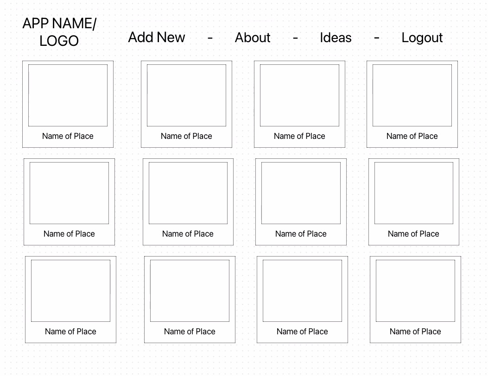
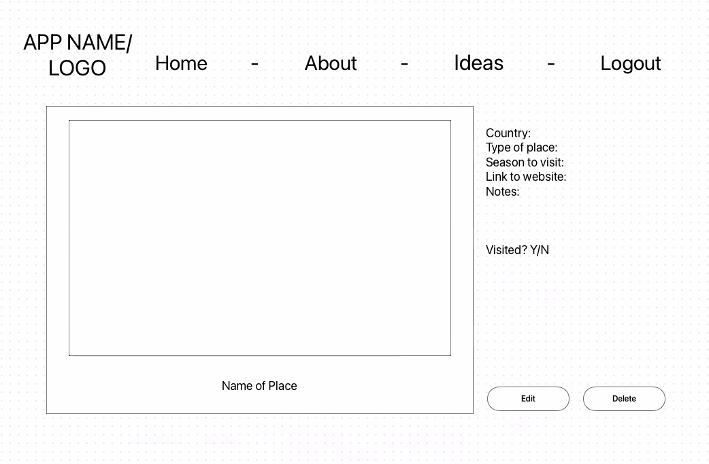
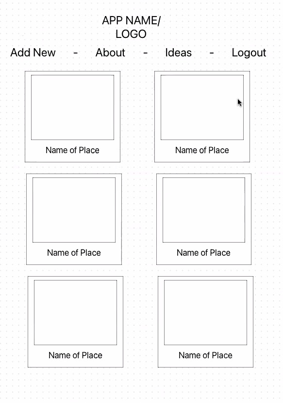
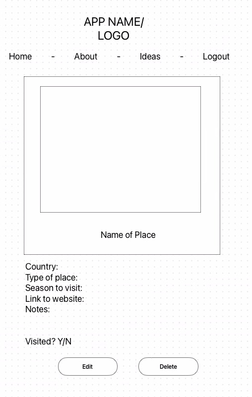

# **Project Name: BonVoyage**
## **Project By:** Arielle Gironza, Harpreet Singh, Je Min Yun, Mrunalee Patel

[**Link to GitHub**](https://github.com/mrunaleepatel/group-project3-frontend)

[**Link to Deployed Site**](https://group-project3-frontend.vercel.app/)

[**Link to Group Trello**](https://trello.com/b/8FuriwSl/ga-seir-kale-p3)

### Description of Project
BonVoyage! Your personalized digital companion to streamline and enhance your travel aspirations! Effortlessly create and manage destinations you’ve visited and wish to visit. With BonVoyage, each destination becomes a chapter and every adventure is crafted to reflect your desires.

### Technologies used
HTML, CSS, SASS, JavaScript, MongoDB, Express.js, ReactJS

### List of React Routes
|PATH|METHOD|PURPOSE|
|--------|------|-------|
|/places|GET|INDEX - Show all places|
|/places|POST|NEW - Render form to create new place|
|/places/:id|DELETE|DESTROY - Delete a place|
|/places/:id|PUT|UPDATE - Update a place|
|/places|POST|CREATE - Create new place|
|/places/:id|GET|EDIT - Render form to update a place|
|/places/:id|GET|SHOW - Show one place|

## List of Components
|COMPONENT|PURPOSE|
|---------|-------|
|Index|Show all places, Form (create new), Links to Show pages| 
|Show|Show a place, Form (update), Delete action|
|Header|App name, Navigation bar|

## Mockup of UI
### DESKTOP VIEWS

### MOBILE VIEWS

## Mockup video 

https://github.com/mrunaleepatel/group-project3-frontend/assets/130593688/d3c484f9-0882-441e-8c3a-c614005361cd

